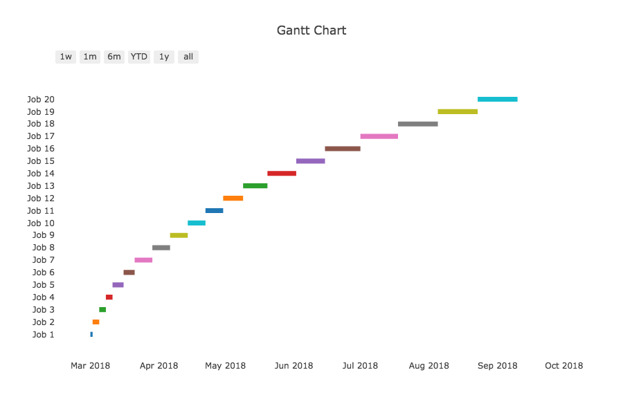

# Title

## What is a "greedy" algorithm?
A greedy algorithm goes about solving a problem by breaking it down into different simple problems that can be solved independently.  When all of these smaller problems are solved, the solutions would combine and form one that can be "globally optimal."

## Examples of a greedy algorithm
### Locally optimal solution leads to a globally optimal solution
Take for example a set of dollar bills, each of a different value, from $1 to $100 ($1, $5, $10, $20, $50, $100).  If allowed to take n bills, **one at a time**, how would you choose as to maximize the amount of money you would get?  

If given the option to choose only one dollar bill out of the set, this algorithm would choose the one of the most "optimal" value, $100.  

Now, you may choose a second dollar bill.  In order to obtain the most amount of money possible, which one would you choose?  

If you chose $50, you would end up with $150, which, if only given the chance to choose two dollar bills, would be the most optimal solution to the global problem:  How do I acquire the most amount of money possible?  By deciding to pick up the dollar bill of the largest value ($100), and then deciding on the one of the second-to-largest value ($50), you have followed the logical process any greedy algorithm would take. This process is breaking the problem up into smaller bits to eventually reach a global optimum.

```python
max([1, 5, 10, 20, 50, 100]) # returns 100
max([1, 5, 10, 20, 50]) # returns 50
max([1, 5, 10, 20]) # returns 20
...
```

### Greedy algorithms don't always lead to a globally optimal solution
Now, consider a network of roads that you would take from your house to reach a destination.  The goal - the global problem - is to reach your destination while travelling the smallest distance possible.  

Suppose there is one street on the route that is 100 yards long, and another 200 yards long.  Which street would you choose to take as to minimize the distance you travel?

Choosing the 100-yard street solves a local problem - you have solved one part of the global problem in order to get closer to reaching the global solution.  

However, after taking the 100-yard 


## Real world problem
### Interval scheduling (the code you wrote)

